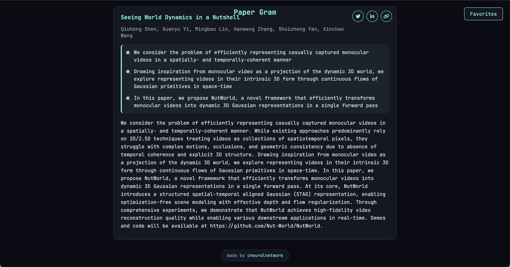

# 📚 Paper Gram

A modern, beautiful interface for discovering and managing academic research papers in AI, Machine Learning, and related fields.

<div align="center">

<a href="https://papergram.netlify.app">
    
</a>

[Try Paper Gram →](https://papergram.netlify.app)

</div>

## 🌟 Features

### Paper Discovery
- Real-time feed of latest research papers from arXiv
- Automatic categorization and filtering of AI/ML papers
- Infinite scroll for seamless browsing
- Smart extraction of key findings and results

### Smart Content Processing
- LaTeX math equation rendering
- Automatic highlighting of key technical terms
- Intelligent diagram generation based on paper content
- Extraction of key results and findings

### Social Features
- Save favorite papers for quick access
- Share papers directly to Twitter and LinkedIn
- Easy link copying with one click
- Favorites panel for managing saved papers

## 🛠️ Technical Stack

- Vanilla JavaScript
- CSS3 with custom properties
- HTML5
- External Libraries:
  - KaTeX for LaTeX rendering
  - Font Awesome for icons
  - JetBrains Mono font

## 📦 Installation

1. Clone the repository:
   ```bash
   git clone https://github.com/cneuralnetwork/papergram.git
   ```

2. Navigate to the project directory:
   ```bash
   cd papergram
   ```

3. Open `index.html` in your browser or use a local server:
   ```bash
   python -m http.server 8000
   ```

## 🚀 Usage

1. Visit the website
2. Scroll through papers using mouse wheel or touch gestures
3. Click the heart icon to save papers to favorites
4. Use the share buttons to share interesting papers
5. Access your saved papers through the Favorites button

## 🤝 Contributing

Contributions are welcome! Please feel free to submit a Pull Request.

## 📄 License

[](https://choosealicense.com/licenses/mit/)

This project is licensed under the MIT License - see the [LICENSE](LICENSE) file for details.

## 👏 Credits

Created by [cneuralnetwork](https://cneuralnets.netlify.app)
